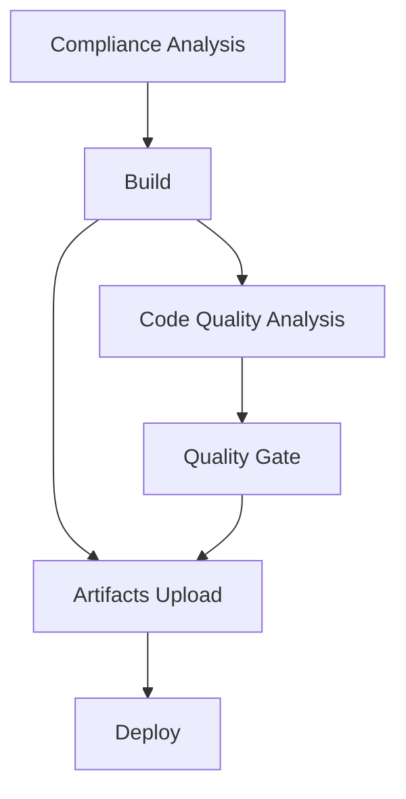

# Azure Pipelines Workflow Documentation

## Workflow Diagram

## Stage Documentation
### 1. Compliance Analysis
- **Stage Name:** `compliance`
- **Description:** Performs compliance checks and ensures the code adheres to required standards.

### 2. Build
- **Stage Name:** `build`
- **Depends On:** `compliance`
- **Description:** Builds the project after compliance checks are completed.

### 3. Code Quality Analysis
- **Stage Name:** `qualityAnalysis`
- **Depends On:** `build`
- **Description:** Analyzes the code quality using tools like SonarQube.

### 4. Quality Gate
- **Stage Name:** `qualityGate`
- **Depends On:** `qualityAnalysis`
- **Description:** Ensures the code meets the quality gate criteria.

### 5. Artifacts Upload
- **Stage Name:** `artifactsUpload`
- **Depends On:** `build`, `qualityGate`
- **Description:** Uploads build artifacts for further use.

### 6. Deploy
- **Stage Name:** `deploy`
- **Depends On:** `build`, `artifactsUpload`
- **Description:** Deploys the application after all previous stages are successfully completed.# AITour-Exemplo05-MarkdownFlow
AITour Exemplo05 MarkdownFlow
